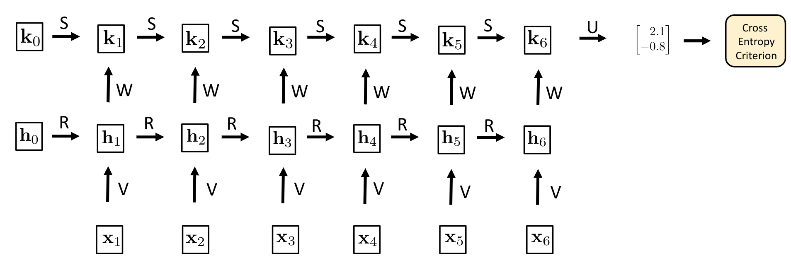
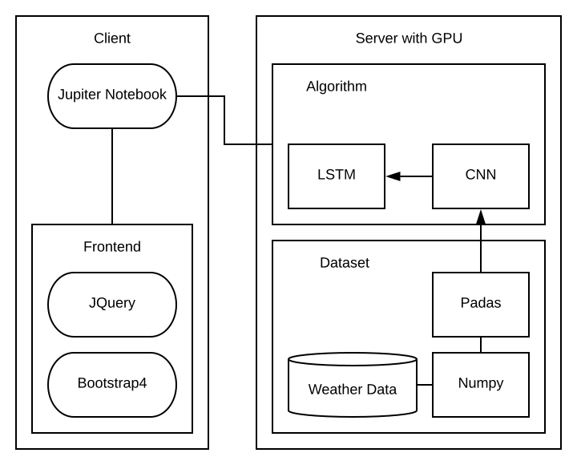
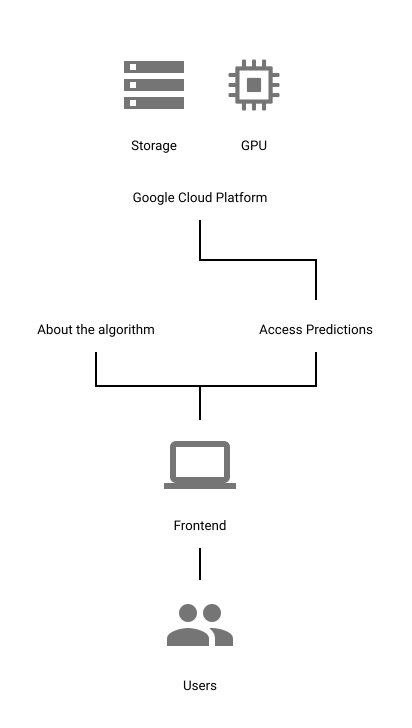

# 6.0 Software Design Description

#### Outline of Software Development Plan

6.1 Introduction

6.1.1 System Objectives

6.1.2 Hardware, Software and Human Interfaces

6.2 Architectural Design

6.2.1 Major Software Components

6.2.2 Architectural Design Diagrams

6.3 Function and Requirements Descriptions

6.3.1 Class Descriptions

## 6.1 Introduction

This document presents the architecture and detailed design for the software for Deeper Insights. The department of Civil Engineering and Environmental Sciences at LMU seeks an deep learning solution for the better prediction of El Niño and climate change. Climate change predictions are currently being made by statiscial models which are not accurate. Scientists need a more efficient system to make such predictions. Through Deeper Insights three main functions: Harness the powrt of big data, defeat the accuracy of current statiscial and dynamical models and producing an algorithm that is fast and simple, users are enabled to effectively use this algorithm and create better predictions.

### 6.1.1 System Objectives

This system will be uniquely customized to suit the needs of the department of Civil Engineering and Environmental Sciences at LMU.  It will professors and students, who has access to the internet,
(mobile or desktop) to view the Deeper Insight's algorithm predictions and use these results for research as an example. Specifically, the users will be able to access these predictions  for free.

### 6.1.2 Hardware, Software and Human Interfaces

| **Interface   Type**   | **Interface   Description** |
| ---------------------- | --------------------------- |
| **Human Interface**    | Mouse and Keyboard          |
| **Human Interface**    | Monitor                     |
| **Hardware Interface** | Computer                    |
| **Software Interface** | Server                      |

## 6.2 Architectural Design

The Deeper insights system architecture is comprised of a web-browser-based user interface (front-end), a RNN algorithm (backend). The front end consists of a single webpage which allows users to see the predictions being made by the algorithm. The RNN algorithm will be designed to allow fast predictions as new data is available. The algorithm and data will be hosted on a Google Cloud Server.

### 6.2.1 Major Software Components

* **Front End** 
  * About page
  * Main page
    * Climate Display
    * Navigation bar
      * Button linkind to the about page
      * El Niño predictions
      * Chimate Change
* **RNN algorithm**
  * The algorithm is one RNN module
* **Server**
  * Google cloud hosted on a VM using a Tesla V100 GPU
  * Using US-central-c1 in Iowa
  *  Will be hosted under natidibbern@gmail account

### 6.2.2 Architectural Design Diagrams

**Figure 1: RNN scaled down architectural design**

**Figure 2: Deeper Insight Software Architectural Diagram**

#### Use Case Diagram

**Figure 3: Deeper Insight Use Case Diagram for Overall Features**

# 6.3 Function and Requirements Descriptions

 In the requirements that follow, "user" is understood to be professors and students from the Department of Civil Engineering and Environmental Sciences at LMU. Users will have the ability to access the Deeper Insights predictions at any time.

### 6.3.1 Class Descriptions

### 6.3.1.1  Frontend

The Deeper Insight's Frontend is a critical component  because if allows users to visualize the RNN algorithm predictions and undertand what they mean. 

### 6.3.1.2  Server

The Server  is where the algorithm will be stored and run. This will be a Google Cloud Server.

### 6.3.1.3 RNN Algorithm

The RNN algorithm will be designed to allow fast predictions as new data is available.